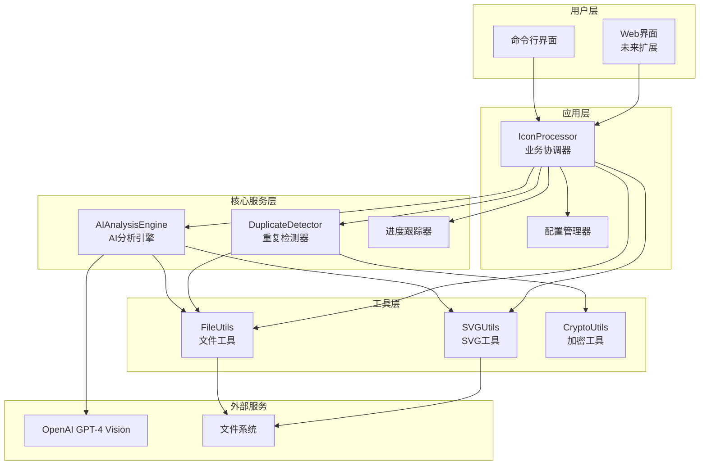
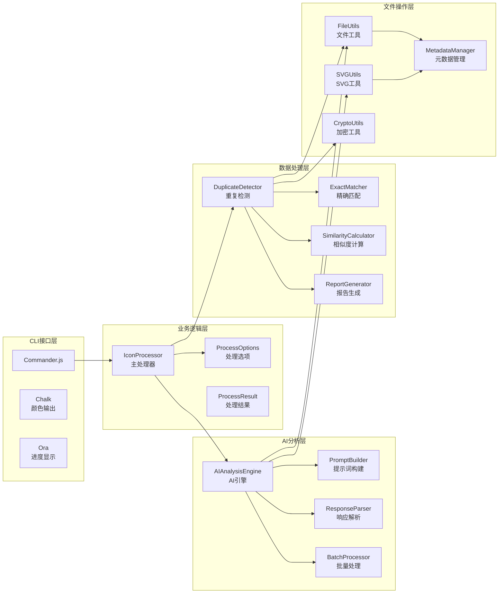
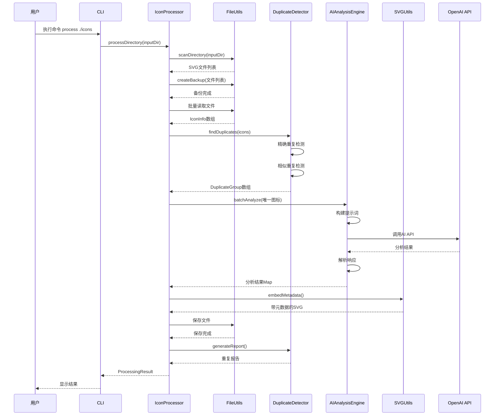
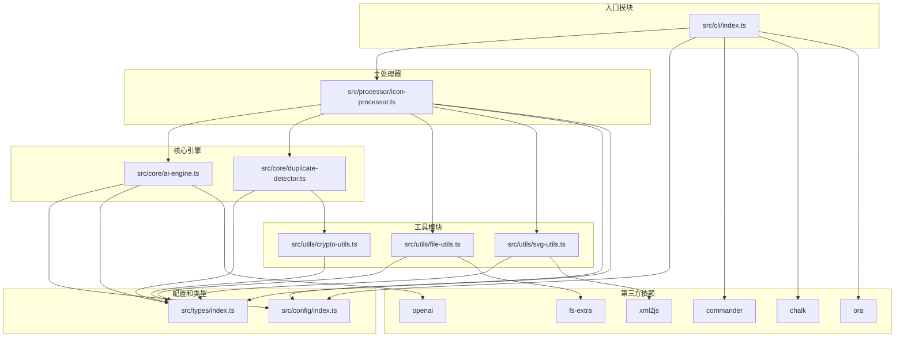
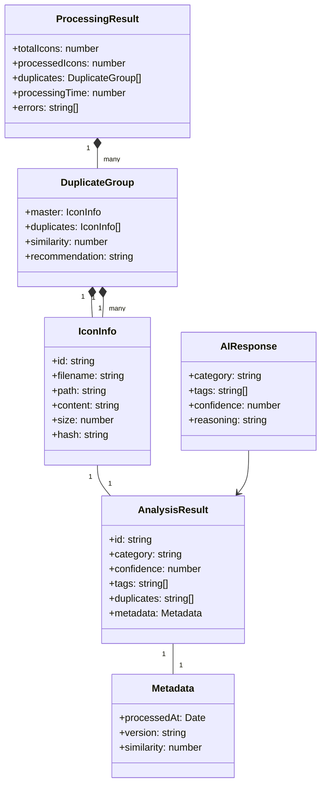
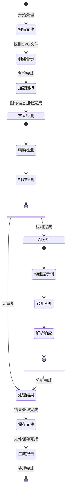
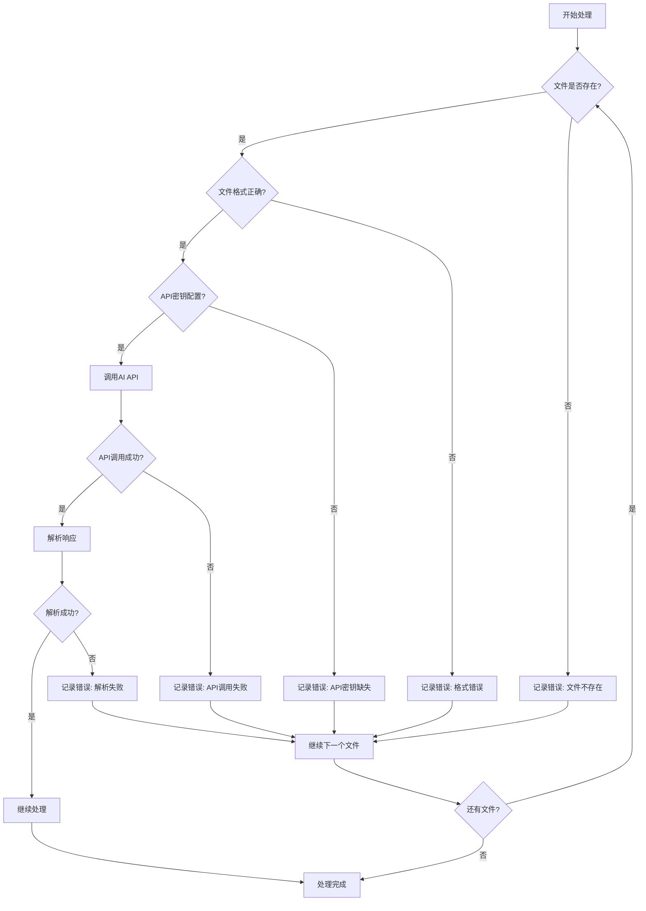

# Icon Normalizer 架构图和调用链

## 1. 整体架构图



## 2. 详细组件架构



## 3. 数据流图



## 4. 详细调用链

```mermaid
graph TD
    A[CLI: icon-normalizer process ./icons] --> B[IconProcessor.processDirectory()]
    
    B --> C1[FileUtils.scanDirectory()]
    C1 --> D[SVG文件列表]
    
    B --> C2[创建备份目录]
    C2 --> E[备份原始文件]
    
    B --> C3[加载图标信息]
    C3 --> F[IconInfo数组]
    
    B --> C4[DuplicateDetector.findDuplicates()]
    C4 --> G1[精确重复检测]
    G1 --> G11[计算文件哈希]
    G11 --> G12[按哈希分组]
    G12 --> G13[生成重复组]
    
    C4 --> G2[相似重复检测]
    G2 --> G21[两两比较]
    G21 --> G22[计算相似度]
    G22 --> G23[阈值过滤]
    G23 --> G24[生成分组]
    
    G1 --> H[DuplicateGroup数组]
    G2 --> H
    
    B --> C5[AIAnalysisEngine.batchAnalyze()]
    C5 --> I1[批量处理控制]
    I1 --> I2[analyzeIcon()]
    I2 --> I21[构建提示词]
    I21 --> I22[转换SVG格式]
    I22 --> I23[调用OpenAI API]
    I23 --> I24[解析JSON响应]
    I24 --> I25[返回AIResponse]
    
    I2 --> J[分析结果Map]
    
    B --> C6[处理结果]
    C6 --> K1[SVGUtils.embedMetadata()]
    K1 --> K11[添加XML注释]
    K11 --> K12[嵌入分类信息]
    
    C6 --> K2[FileUtils.writeFile()]
    K2 --> K21[保存到输出目录]
    K21 --> K22[创建子目录]
    
    C6 --> K3[生成报告]
    K3 --> K31[DuplicateDetector.generateReport()]
    K31 --> K32[保存到文件]
    
    B --> L[返回ProcessingResult]
```

## 5. 模块依赖关系图



## 6. 数据结构关系图



## 7. 状态转换图



## 8. 错误处理流程



这些图表展示了 Icon Normalizer 的完整架构、调用链和数据流，可以帮助开发者更好地理解系统结构和各个模块之间的关系。